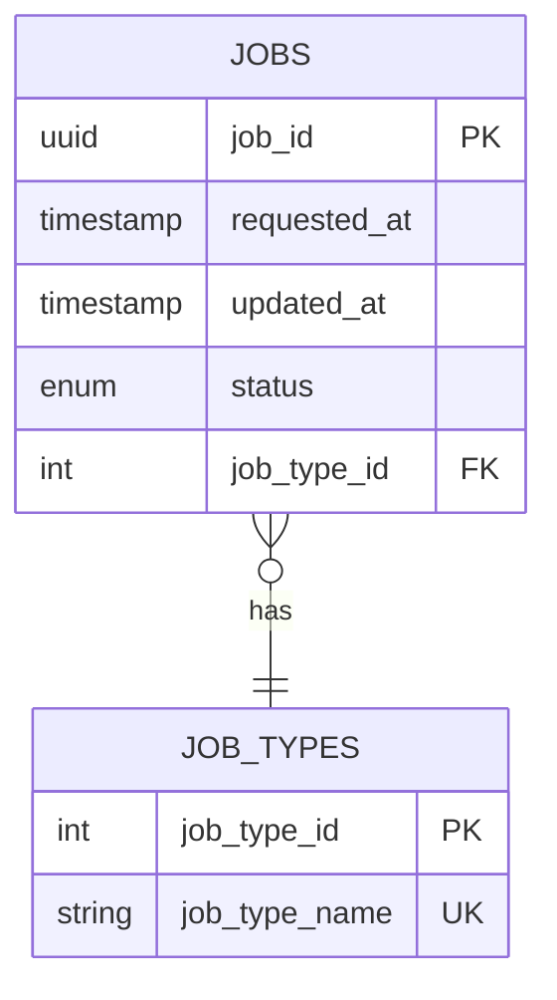

```mermaid
erDiagram
    JOBS {
        uuid job_id PK
        timestamp requested_at
        timestamp updated_at
        enum status
        int job_type_id FK
    }

    JOB_TYPES {
        int job_type_id PK
        string job_type_name UK
    }


    JOBS }o--|| JOB_TYPES : has
```
